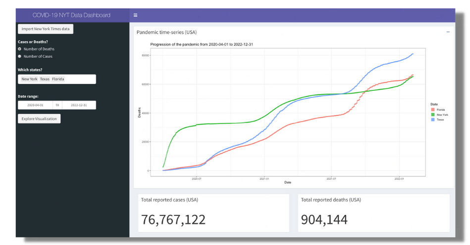

A simple example of [`shiny`](https://github.com/rstudio/shiny) and [`shinydashboards`](https://github.com/rstudio/shinydashboard) to build your first interactive dashboard.

## Our Goal

> Give our user the opportunity to see reported COVID-19 cases for selected states over a specified time window using the [New York Times COVID-19 data](https://github.com/nytimes/covid-19-data/blob/master/us-states.csv).

## Our Data

The New York times [updates this data almost daily](https://github.com/nytimes/covid-19-data/commits/master/us-states.csv). Here is the url to the latest `.csv` file - 
https://raw.githubusercontent.com/nytimes/covid-19-data/master/us-states.csv.

## Our App

See [app.R](app.R) for the script. For some details on the script see [A Brief Introduction to R-Shiny and Dashboards](https://ki-tools.github.io/RShinyDashboards/). We recommend [shinyintro](https://debruine.github.io/shinyintro/index.html) to get a little more comfortable with Shiny.

## Elements used

We used quite a few elements that our slides didn't cover.  Each `shiny` and `shinydashboard` function used in our example app is referenced below.
### [shinydashboard](https://rstudio.github.io/shinydashboard/)

- [dashboardPage()](https://rstudio.github.io/shinydashboard/structure.html#structure-overview)
- [dashboardHeader()](https://rstudio.github.io/shinydashboard/structure.html#header)
- [dashboardSidebar()](https://rstudio.github.io/shinydashboard/structure.html#sidebar)
- [dashboardBody()](https://rstudio.github.io/shinydashboard/structure.html#body)
- [box()](https://rstudio.github.io/shinydashboard/structure.html#boxes)

### [Shiny package](https://shiny.rstudio.com/reference/shiny/1.6.0/)

- [actionButton()](https://shiny.rstudio.com/reference/shiny/1.6.0/actionButton.html)
- [radioButtons()](https://shiny.rstudio.com/reference/shiny/1.6.0/radioButtons.html)
- [dateRangeInput()](https://shiny.rstudio.com/reference/shiny/1.6.0/dateRangeInput.html)

- [plotOutput()](https://shiny.rstudio.com/reference/shiny/1.6.0/plotOutput.html)
- [textOutput()](https://shiny.rstudio.com/reference/shiny/1.6.0/textOutput.html)

- [renderText()](https://shiny.rstudio.com/reference/shiny/1.6.0/renderPrint.html)
- [renderPlot()](https://shiny.rstudio.com/reference/shiny/1.6.0/renderPlot.html)
- [observeEvent()](https://shiny.rstudio.com/reference/shiny/1.6.0/observeEvent.html)

- [reactiveVal()](https://shiny.rstudio.com/reference/shiny/1.6.0/reactiveVal.html)
- [isolate()](https://shiny.rstudio.com/reference/shiny/1.6.0/isolate.html)

- [div()](https://shiny.rstudio.com/reference/shiny/1.6.0/builder.html)

- [shinyApp()](https://shiny.rstudio.com/reference/shiny/1.6.0/shinyApp.html)
